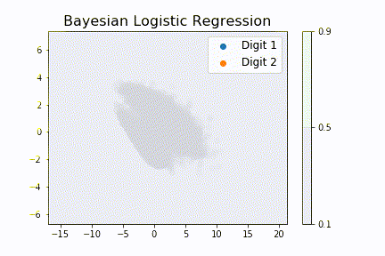
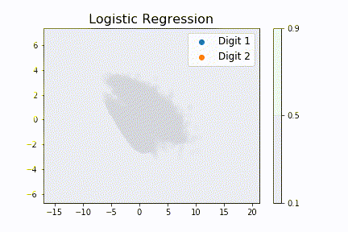

# Multinomial Bayesian Logistic Regression

Extending [Valassis-Digital-Media's binary bayesian logistic](https://github.com/Valassis-Digital-Media/bayes_logistic) 
to multinomial (i.e. multiclass) cases. 

Largely based on Section 8.4 of 
[Murphy's "Machine learning: a probabilistic perspective"](https://mitpress.mit.edu/books/machine-learning-1)

## Usage

### [Demo](test/integrated/test_parkinsons.py) on the [UCI parkinsons dataset](https://archive.ics.uci.edu/ml/datasets/parkinsons): 

```python

import numpy as np
import pandas as pd

import multinomial_bayes_logistic as mbl

# Download and process data
url = "http://archive.ics.uci.edu/ml/machine-learning-databases/parkinsons/parkinsons.data"
df = pd.read_csv(url)
y = df.values[:, 17]
y = y.astype(int)
X = np.delete(df.values, 17, 1)
X = np.delete(X, 0, 1)

# Add bias column to the feature matrix
...

# Perform feature scaling using mean normalization
...

# The data is divided into training and test sets
...

# Train the model
n_classes = 2

w_prior = np.zeros((n_classes, training_X.shape[1]))
H_prior = np.eye((n_classes * (n_features + 1)), (n_classes * (n_features + 1)))

w_posterior, H_posterior = mbl.fit(training_y,
                                   training_X,
                                   w_prior, H_prior)

# Get Bayes point and Monte Carlo probabilities
test_probs, preds, max_probs = mbl.get_bayes_point_probs(test_X, w_posterior)
bayes_acc =  np.mean(preds == test_y)


test_probs, preds, max_probs = mbl.get_monte_carlo_probs(test_X, w_posterior, H_posterior)
mc_acc = np.mean(preds == test_y)
```

### [Demo](examples/MNIST/2_Bayesian_FC.ipynb) on the extracted [MNIST CNN Features](examples/MNIST/1_CNN_Feature_Extraction.ipynb):

### Animations

[Notebook](examples/MNIST/3_Visualizing_2_Classes.ipynb): Bayes point moderates the probability (i.e. decreases the certainty) 
as we move get more distant from the datapoints, as compared to probit (i.e. regularized logistic regression)





### Dependencies

```
numpy
scipy
sklearn (optional - to visualize TSNE and PCA)
autograd (optional - to use in pytest)
matplotlib (optional - to visualize decision boundaries)
```